# Database schema

> DO NOT HAND-EDIT. Generated from `drift_schemas/app_database/drift_schema_v15.json` by `tools/db_diagram.dart`. Regenerate with `make db-diagram`.

## ER diagram - schema v15

Renders on GitHub and in VS Code Markdown preview.

```mermaid
erDiagram
  copies {
    TEXT id PK "required"
    TEXT title_id "required"
    TEXT barcode UK "required"
    TEXT shelf "nullable, max 60"
    TEXT status "required, CopyStatus"
    DATETIME acquired_at "required"
    TEXT notes "nullable"
    DATETIME created_at "required"
    DATETIME updated_at "required"
    DATETIME archived_at "nullable"
  }
  fines {
    TEXT id PK "required"
    TEXT member_id "required"
    TEXT loan_id "nullable"
    TEXT reason "required, FineReason"
    INTEGER assessed "required, Money"
    INTEGER paid "required, Money"
    INTEGER waived "required, Money"
    DATETIME raised_at "required"
    DATETIME settled_at "nullable"
    TEXT note "nullable"
    DATETIME created_at "required"
    DATETIME updated_at "required"
  }
  library_settings {
    INTEGER id PK "required"
    TEXT name "required, max 160"
    TEXT currency "required, max 3"
    TEXT currency_name "required, max 80"
    TEXT currency_symbol "required, max 16"
    TEXT email "nullable, max 254"
    TEXT phone "nullable, max 40"
    TEXT address "nullable, max 400"
    TEXT opening_hours "nullable, max 200"
    TEXT barcode_prefix "required"
    INTEGER barcode_next_value "required"
    TEXT member_barcode_prefix "required"
    INTEGER member_barcode_next_value "required"
    TEXT staff_barcode_prefix "required"
    INTEGER staff_barcode_next_value "required"
    TEXT logo_ref "nullable"
    DATETIME created_at "required"
    DATETIME updated_at "nullable"
  }
  loan_rules {
    INTEGER id PK "required"
    INTEGER loan_period_days "required"
    INTEGER borrowing_limit "required"
    INTEGER renewal_limit "required"
    INTEGER renewal_period_days "nullable"
    INTEGER fine_per_day "required, Money"
    INTEGER grace_days "required"
    INTEGER maximum_fine_per_copy "required, Money"
    INTEGER max_outstanding_fine "nullable, Money"
    INTEGER membership_duration_months "required"
    INTEGER reservation_limit "required"
    INTEGER hold_shelf_days "required"
    BOOLEAN block_overdue_borrowers "required"
    BOOLEAN auto_renew_when_unreserved "required"
    DATETIME updated_at "required"
  }
  loans {
    TEXT id PK "required"
    TEXT copy_id "required"
    TEXT member_id "required"
    DATETIME checked_out_at "required"
    TEXT due_at "required, DateTime"
    DATETIME returned_at "nullable"
    INTEGER renewal_count "required"
    TEXT return_condition "nullable, CopyCondition"
    TEXT checked_out_by_staff_id "nullable"
    TEXT returned_by_staff_id "nullable"
    INTEGER rule_loan_period_days "required"
    INTEGER rule_fine_per_day "required, Money"
    INTEGER rule_grace_days "required"
    INTEGER rule_maximum_fine "required, Money"
    DATETIME created_at "required"
  }
  member_types {
    TEXT id PK "required"
    TEXT code UK "nullable"
    TEXT name "required, max 60"
    INTEGER sort_order "required"
    BOOLEAN is_system "required"
    DATETIME archived_at "nullable"
    DATETIME created_at "required"
    INTEGER loan_period_days "nullable"
    INTEGER borrowing_limit "nullable"
    INTEGER renewal_limit "nullable"
    INTEGER renewal_period_days "nullable"
    INTEGER fine_per_day "nullable, Money"
    INTEGER grace_days "nullable"
    INTEGER maximum_fine_per_copy "nullable, Money"
    INTEGER max_outstanding_fine "nullable, Money"
    INTEGER membership_duration_months "nullable"
    INTEGER reservation_limit "nullable"
  }
  members {
    TEXT id PK "required"
    TEXT barcode UK "required"
    TEXT full_name "required, max 160"
    TEXT member_type_id "required"
    TEXT gender "nullable, Gender"
    TEXT date_of_birth "nullable, DateTime"
    TEXT blood_group "nullable, BloodGroup"
    TEXT email "nullable"
    TEXT phone "nullable"
    TEXT address "nullable"
    TEXT municipality "nullable, max 80"
    TEXT occupation "nullable, max 80"
    TEXT institution "nullable, max 120"
    TEXT id_verification "nullable, max 80"
    TEXT emergency_contact_name "nullable, max 80"
    TEXT emergency_contact_phone "nullable, max 40"
    TEXT guardian "nullable"
    TEXT notes "nullable"
    DATETIME joined_at "required"
    TEXT expires_at "nullable, DateTime"
    DATETIME suspended_at "nullable"
    TEXT suspension_reason "nullable"
    BOOLEAN send_notices "required"
    DATETIME created_at "required"
    DATETIME updated_at "required"
    DATETIME archived_at "nullable"
  }
  members_fts {
    TEXT full_name "required"
    TEXT barcode "required"
    TEXT email "required"
    TEXT phone "required"
    TEXT address "required"
    TEXT municipality "required"
    TEXT occupation "required"
    TEXT institution "required"
    TEXT id_verification "required"
    TEXT emergency_contact_name "required"
    TEXT guardian "required"
  }
  reservations {
    TEXT id PK "required"
    TEXT title_id "required"
    TEXT member_id "required"
    DATETIME placed_at "required"
    TEXT status "required, ReservationStatus"
    TEXT ready_copy_id "nullable"
    DATETIME ready_at "nullable"
    TEXT expires_at "nullable, DateTime"
    DATETIME closed_at "nullable"
    DATETIME created_at "required"
    DATETIME updated_at "required"
  }
  staff {
    TEXT id PK "required"
    TEXT name "required, max 120"
    TEXT email UK "required, max 254"
    TEXT password_hash "required"
    TEXT role "required, UserRole"
    TEXT status "required, UserStatus"
    TEXT barcode "nullable"
    DATETIME created_at "required"
  }
  staff_recovery_codes {
    TEXT id PK "required"
    TEXT staff_id "required"
    TEXT code_hash "required"
    DATETIME used_at "nullable"
    DATETIME created_at "required"
  }
  title_formats {
    TEXT id PK "required"
    TEXT code UK "nullable"
    TEXT name "required, max 60"
    INTEGER sort_order "required"
    BOOLEAN is_system "required"
    DATETIME archived_at "nullable"
    DATETIME created_at "required"
  }
  titles {
    TEXT id PK "required"
    TEXT title "required, max 300"
    TEXT author "required, max 200"
    TEXT isbn "nullable, max 20"
    TEXT publisher "nullable, max 200"
    INTEGER published_year "nullable"
    TEXT edition "nullable, max 80"
    INTEGER pages "nullable"
    TEXT format_id "required"
    TEXT language "required"
    TEXT description "nullable"
    TEXT shelf "nullable, max 60"
    BOOLEAN lendable "required"
    INTEGER replacement_cost "required, Money"
    DATETIME created_at "required"
    DATETIME updated_at "required"
    DATETIME archived_at "nullable"
  }
  titles_fts {
    TEXT title "required"
    TEXT author "required"
    TEXT isbn "required"
    TEXT publisher "required"
    TEXT shelf "required"
  }
```

## Tables

### `copies`

- Source: `lib/features/catalog/copy/data/tables/copies.dart`
- No outgoing foreign keys.

### `fines`

- Source: `lib/features/circulation/fine/data/tables/fines.dart`
- Enforces `CHECK (assessed >= 0)`.
- Enforces `CHECK (paid >= 0)`.
- Enforces `CHECK (waived >= 0)`.
- Enforces `CHECK (paid + waived <= assessed)`.
- No outgoing foreign keys.

### `library_settings`

- Source: `lib/features/settings/data/tables/library_settings.dart`
- Enforces `CHECK (id = 1)`.
- No outgoing foreign keys.

### `loan_rules`

- Source: `lib/features/settings/data/tables/loan_rules.dart`
- Enforces `CHECK (id = 1)`.
- No outgoing foreign keys.

### `loans`

- Source: `lib/features/circulation/loan/data/tables/loans.dart`
- No outgoing foreign keys.

### `member_types`

- Source: `lib/features/members/data/tables/member_types.dart`
- No outgoing foreign keys.

### `members`

- Source: `lib/features/members/data/tables/members.dart`
- No outgoing foreign keys.

### `members_fts`

- Source: `a Drift Table class registered in lib/core/database/app_database.dart`
- No outgoing foreign keys.

### `reservations`

- Source: `lib/features/circulation/reservation/data/tables/reservations.dart`
- Enforces `CHECK ((closed_at IS NULL) = (status IN ('waiting', 'ready')))`.
- No outgoing foreign keys.

### `staff`

- Source: `lib/features/users/data/tables/staff.dart`
- No outgoing foreign keys.

### `staff_recovery_codes`

- Source: `a Drift Table class registered in lib/core/database/app_database.dart`
- No outgoing foreign keys.

### `title_formats`

- Source: `lib/features/catalog/title/data/tables/title_formats.dart`
- No outgoing foreign keys.

### `titles`

- Source: `lib/features/catalog/title/data/tables/titles.dart`
- Enforces `CHECK (published_year IS NULL OR (published_year >= 1000 AND published_year <= 2200))`.
- Enforces `CHECK (pages IS NULL OR pages > 0)`.
- No outgoing foreign keys.

### `titles_fts`

- Source: `a Drift Table class registered in lib/core/database/app_database.dart`
- No outgoing foreign keys.
